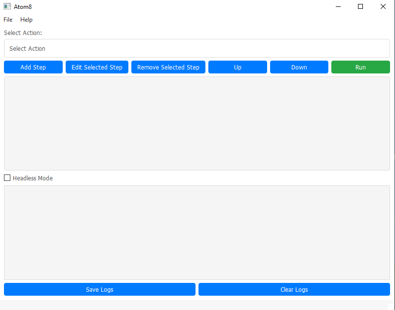
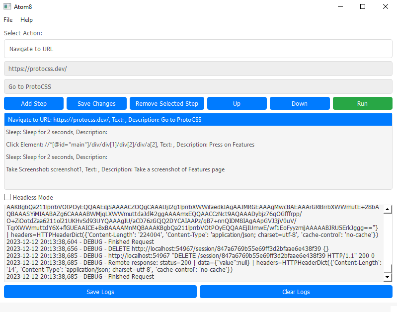

# Atom8

## Overview

Atom8 is an advanced web automation tool engineered to streamline and simplify complex web-based operations. With its focus on precision and ease of use, Atom8 stands out as a key resource for professionals aiming to optimize their web tasks. It is adept at automating repetitive processes, rigorously testing web applications, and efficiently gathering data from various web sources. This tool is tailored to enhance productivity, accuracy, and effectiveness in handling a wide array of web automation challenges.

Atom8 uses the Selenium framework to automate web actions. It is built using Python and features a user-friendly graphical interface. The tool is compatible with Windows, Mac, and Linux operating systems.

## Why Atom8 is Ideal for QA Professionals

### For QA Professionals
- **Comprehensive Testing Capabilities:** Atom8 provides extensive features for testing web applications, making it easier to identify issues and ensure quality. Its automation capabilities can simulate a wide range of user interactions, making testing more thorough and efficient.
- **Customizable Automation Scripts:** QA professionals can create custom scripts that cater to specific testing needs, allowing for detailed and precise test scenarios.
- **Cross-Platform Compatibility:** With support for Windows, Mac, and Linux, Atom8 can be integrated into diverse testing environments, ensuring consistent performance across different platforms.
- **Time-Saving:** The tool automates repetitive and time-consuming testing tasks, freeing up QA professionals to focus on more complex aspects of quality assurance.
- **Ease of Use:** Atom8's intuitive graphical interface makes it easy for QA professionals to create and execute automation scripts, even without prior programming experience.
- **Error Detection and Reporting:** Atom8's robust error handling aids in quick identification and resolution of issues, enhancing the overall quality of web applications.
- **Cost-Effectiveness:** Atom8 is a free and open-source tool, making it a cost-effective solution for QA professionals.
- **Community Support:** Atom8's growing user community provides a platform for QA professionals to share and collaborate on automation scripts, enabling them to learn from each other and solve common challenges.

## Key Features

- **Intuitive Graphical Interface:** A user-friendly GUI that makes web automation accessible to users of all skill levels.
- **Versatile Web Actions:** Perform a wide range of web actions, including URL navigation, element interaction, text input, and more.
- **Customizable Automation Scripts:** Create custom scripts that cater to specific automation needs, allowing for detailed and precise automation scenarios.
- **Execute Python Scripts:** Run custom Python scripts within Atom8, enabling users to integrate their own code into automation sequences.
- **Headless Mode Execution:** Run automation scripts in a non-GUI mode, ideal for background tasks or systems without a display.
- **Script Management:** Save and load automation steps efficiently, enabling reuse and sharing of complex scripts.
- **Advanced Logging:** Comprehensive logging capabilities for monitoring automation steps and troubleshooting errors.

## Installation Instructions

For now, Atom8 is only available as a Python script. To use the tool, follow these steps:

1. **Install Python:** Download and install the latest version of Python from the official website.
2. **Install Dependencies:** Install the required dependencies by running the following command in the terminal:
   - `pip install -r requirements.txt`
3. **Launch the Tool:** Start Atom8 by executing the Python script.

It will be available as a standalone application in the near future.

## Example Use Cases
Atom8 is versatile and can be applied in numerous domains. Here are some key use cases:

- **Data Scraping and Aggregation:** Automate the extraction of data from websites for purposes like market research, lead generation, or competitive analysis.
- **Form Automation and Submission:** Streamline filling and submitting online forms for surveys, registrations, and bookings.
- **Automated Web Testing:** Conduct thorough testing of web applications for functionality, performance, and user experience.
- **E-commerce Operations:** Automate tasks such as price monitoring, product listings, and inventory management on e-commerce platforms.
- **Content Management:** Dynamically update and manage website content, including blog posts, news articles, and product descriptions.
- **Automated Report Generation:** Compile data from various web sources into structured reports for business analytics and decision-making.
- **Social Media Management:** Automate posting, commenting, and managing social media profiles and pages.
- **SEO Monitoring:** Regularly track and report website rankings, backlinks, and keyword performance.
- **Email Automation:** Automate sending, receiving, and organizing emails for marketing or communication.
- **Online Research:** Conduct extensive online research for academic, scientific, or market analysis purposes.
- **Web Monitoring:** Continuously monitor web pages for changes or updates, crucial for real-time data analysis and decision-making.

Atom8's versatility makes it an invaluable tool for businesses, researchers, marketers, and IT professionals, streamlining a vast array of web-based tasks and projects.

## Usage Instructions

1. **Launch the Tool:** Start Atom8 by executing the Python script.
2. **Create Automation Steps:**
   - Select an action from the provided dropdown menu.
   - Enter necessary details such as URLs, XPaths, and text inputs.
   - Add the step to your automation sequence.
3. **Step Management:**
   - Edit, remove, or reorder steps as needed.
   - Clear the entire step list with a single click.
4. **Execute Automation:**
   - Run your sequence of steps by clicking 'Run'.
5. **Logging:**
   - Review detailed logs for actions and errors.
6. **Headless Mode:**
   - Enable this mode for running the browser without a GUI.

## Screenshots

## License

Atom8 is made available under the MIT License. Please refer to the LICENSE file for detailed terms and conditions.

## Contribute to Atom8

Atom8 is an open-source project and welcomes contributions from the community. If you are interested in contributing, please ‘fork’ this repository and submit a pull request. For more information, please refer to the CONTRIBUTING.md file.
